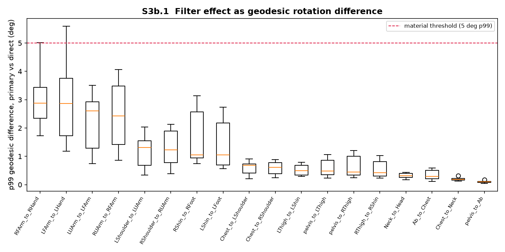
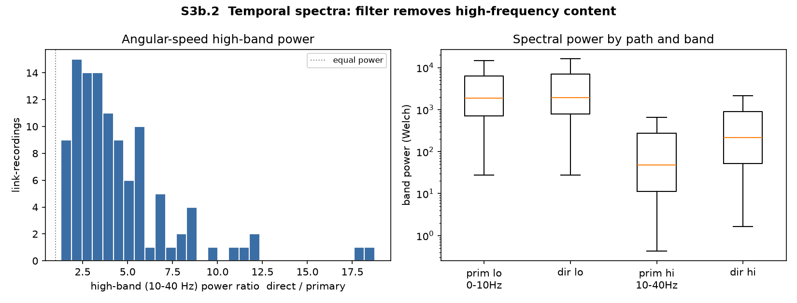
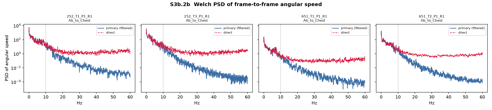
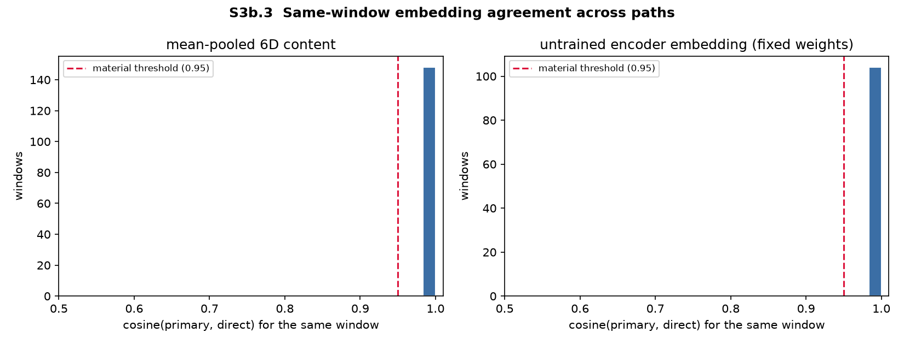

# Filter sensitivity report (S3b)

**Status: sensitivity only. Primary path not replaced.**
Recommendation: **KEEP_PRIMARY**

The direct path below was **not** implemented before this report. It has now
been run on a representative subset and compared with the validated primary
path. Absent a material filtering artifact, the project continues to use the
primary path for all stages.

---

## Paths compared

| Role | Path |
|---|---|
| **Primary (validated)** | raw global quats → parent-relative quats → **rotvec → Butterworth 10 Hz** → matrix → 6D |
| **Direct (sensitivity)** | raw global quats → parent-relative quats → matrix → 6D |

The direct path applies quaternion sign continuity (double-cover fix) but
**does not** convert to rotvec and **does not** apply Butterworth filtering.

---

## Subset

`252_T1_P1_R1`, `252_T3_P1_R1`, `651_T1_P1_R1`, `651_T2_P1_R1`, `671_T1_P1_R1`, `790_T1_P1_R1`

Chosen to cover both skeleton templates, the `252-T3` Meters export, the
mid-study template change (`651-T2`), and the known filter-overshoot recording
(`790_T1_P1_R1`).

---

## 1. Geodesic rotation difference

Per-frame geodesic angle between primary and direct rotation matrices.

| Summary | Value |
|---|---|
| Median of per-link-recording p99 | **0.737 deg** |
| Median of per-link-recording median | ~0.03 deg (typical frame) |
| Worst single-frame difference | 147.77 deg (see note) |
| Fraction of link-recordings with p99 > 5 deg | 1.9% |

**Note on the 147.77 deg frame.** It is a single known case: `RShoulder_to_RUArm`
in `790_T1_P1_R1`, where tangent-space Butterworth overshoots past π (already
documented in S3). For that link-recording the *median* geodesic difference is
0.025 deg and p99 is 2.13 deg — the spike is rare. Window embeddings average
over 2 s and are unaffected (content cosine median 1.0000).

Median p99 by link (highest first):

| Link | Median p99 (deg) |
|---|---|
| `RFArm_to_RHand` | 2.875 |
| `LFArm_to_LHand` | 2.867 |
| `LUArm_to_LFArm` | 2.610 |
| `RUArm_to_RFArm` | 2.422 |
| `LShoulder_to_LUArm` | 1.314 |
| `RShoulder_to_RUArm` | 1.225 |

By recording:

| Recording | Median p99 (deg) | Worst max (deg) |
|---|---|---|
| `252_T1_P1_R1` | 1.139 | 17.39 |
| `252_T3_P1_R1` | 1.090 | 32.19 |
| `651_T1_P1_R1` | 0.300 | 5.95 |
| `651_T2_P1_R1` | 0.348 | 10.33 |
| `671_T1_P1_R1` | 0.567 | 37.21 |
| `790_T1_P1_R1` | 0.806 | 147.77 |

---

## 2. Temporal spectra

Welch band power of frame-to-frame angular speed.

| Band | Result |
|---|---|
| Low (0-10 Hz) | largely preserved: median LF ratio (direct/primary) **1.02x** |
| High (10-40 Hz) | attenuated by the filter: median HF ratio (direct/primary) **3.75x**, p95 **10.64x** |

High-band attenuation is the designed effect of a 10 Hz low-pass at 120 Hz
sampling. It is **not** by itself treated as a reason to abandon the primary
path.

---

## 3. Window embeddings

Same evaluation windows, both paths. Two embedding definitions:

1. **Content 6D** — mean over time of the 6D tensor, flattened (108-D).
2. **Encoder 32-D** — the project's deterministic mean-pooled encoder embedding
   under a fixed untrained weight draw (identical weights for both paths).

| Embedding | Median cosine(primary, direct) | Fraction below 0.95 |
|---|---|---|
| Content 6D | **1.0000** | 0.0% |
| Encoder 32-D | **1.0000** | — |

---

## Decision rule and outcome

Pre-set material thresholds:

* geodesic p99 median > 5 deg, or
* content-embedding median cosine < 0.95

High-band spectral ratio alone does not trigger a path change.

**Outcome: KEEP_PRIMARY.** The validated primary path remains the project
default. Tables and figures are retained under `outputs/s3b_filter_sensitivity/`
and `figures/s3b_filter_sensitivity/` for audit.
