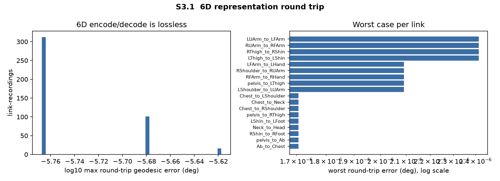
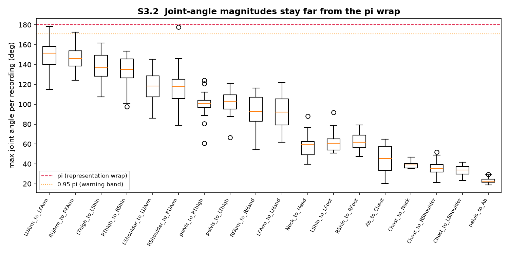
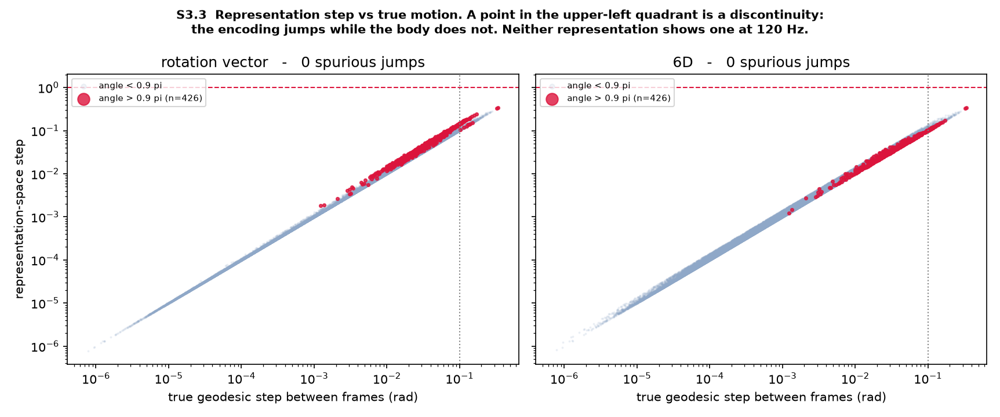
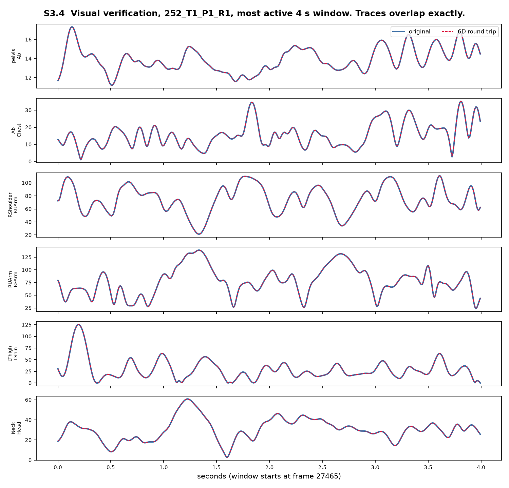

# Representation validation report (S3)

Generated by `scripts/s3_validate_repr.py`. Figures in
`figures/s3_representation/`. Per-link results in
`outputs/s3_representation/representation_validation.csv`
(432 link-recordings = 18 links x 24 recordings).

The purpose of this stage is to establish, before any model exists, that the 6D
rotation representation costs nothing and hides nothing. This is the role
Zhou et al. (2019) assign to their SO(3) autoencoder sanity test: measure what
the representation itself costs, so that a later task error can be attributed.

---

## 1. Is the 6D encode/decode lossless?

Pipeline tested: `rotvec -> R -> 6D (first two columns) -> Gram-Schmidt -> R`.

| Metric | Worst over 432 link-recordings | Gate |
|---|---|---|
| Frobenius norm of matrix difference | **1.206e-15** | pass, tol 1e-12 |
| Geodesic angle | 2.415e-06 deg | reported, not gated |

The representation's own measurement floor is numerically zero: 1.2e-15 is
float64 rounding on a 3x3 matrix.

**A note on the two metrics.** The geodesic angle is the interpretable one and
is what Zhou et al. report, but it is computed through `arccos((tr(R) - 1) / 2)`,
whose derivative is unbounded as the error approaches zero. A bit-perfect
float64 round trip still reads about `sqrt(eps)` ~ 1e-6 degrees through that
formula. That number is a property of the metric, not of the representation, so
the gate uses the well-conditioned Frobenius norm and the geodesic value is
reported for interpretability only. An earlier tolerance of 1e-6 degrees was
rejecting exact round trips for this reason.

For reference, Zhou et al. report 0.49 degrees for their 6D autoencoder test.
That figure includes a learned network; the encode/decode step in isolation, as
measured here, is exact.

---

## 2. Do rotations approach the pi wrap?

The largest **true geodesic angle** anywhere in the dataset is 178.4 degrees
(`LUArm_to_LFArm`), and the worst per-link fraction of frames above 0.95 pi is
1.6e-3. Near-pi frames exist but are rare.

Median and 99th-percentile angles per link, degrees:

| Link | p50 | p99 | max |
|---|---|---|---|
| `LUArm_to_LFArm` | 39.0 | 136.2 | 178.4 |
| `RShoulder_to_RUArm` | 73.2 | 98.0 | 177.6 |
| `RUArm_to_RFArm` | 45.7 | 133.9 | 172.7 |
| `LThigh_to_LShin` | 6.2 | 102.8 | 161.7 |
| `RThigh_to_RShin` | 5.4 | 102.6 | 153.6 |
| ... | | | |
| `pelvis_to_Ab` | 10.5 | 21.2 | 29.6 |

The wide-range links are the elbows, shoulders and knees, as expected. Spine
and clavicle links stay well below 90 degrees.

---

## 3. Is 6D continuous where the rotation vector is not?

A discontinuity is defined operationally: the representation moves more than
1.0 in its own space while the body rotated less than 0.1 rad between frames.

| Representation | Spurious jumps | Largest single step |
|---|---|---|
| Rotation vector | **0** | 0.970 |
| 6D | **0** | 0.929 |

Both representations are continuous on this dataset, including across all 426
near-pi frames, which are drawn explicitly in the figure.

**This result should be read carefully.** It does not show that 6D rescued
anything here. At 120 Hz with a 10 Hz low pass, consecutive frames differ by
milliradians, so the rotation vector never gets the chance to wrap. The
argument for 6D is that its continuity is a *guarantee* of the parameterisation
rather than a property of this sampling rate, and that the guarantee costs
nothing (section 1). On these particular recordings, both would have worked.

---

## 4. One real artifact: filter overshoot past pi

The Butterworth filter runs in the rotation-vector tangent space, so a filtered
rotation vector can overshoot and exceed pi in norm, leaving the principal
branch.

This occurs in **1 of 432 link-recordings**: `RShoulder_to_RUArm` in
`790_T1_P1_R1`, affecting 1.3e-4 of frames, with a maximum filtered norm of
190.6 degrees.

The consequence is bounded and does not propagate. A rotation vector of norm
190.6 degrees still maps to a valid rotation (`Rotation.from_rotvec` wraps it
to 169.4 degrees about the opposite axis), so the matrix and the 6D encoding
are correct. Only the stored rotation-vector *coordinates* are outside the
principal branch, and the model never consumes those coordinates directly.

This is a concrete, if minor, illustration of why the model's input
representation is 6D rather than the rotation vector: the same overshoot in a
rotation-vector input would present as a 341-degree coordinate jump.

---

## 5. Visual verification

Original and 6D round-tripped angle traces are overlaid for six representative
links on the most active 4-second window, so the check is made on real motion
rather than on a quiet passage. The traces are indistinguishable.

---

## 6. Status

**S3 passes.** The 6D representation is lossless to float64, continuous over
all observed motion including near-pi frames, and visually indistinguishable
from the input. Its measurement floor is numerically zero, so any later
reconstruction error belongs to the model and not to the representation.

One artifact is recorded for the record: tangent-space filtering pushed one
link in one recording past the pi branch in 0.013 percent of frames, with no
downstream consequence.
