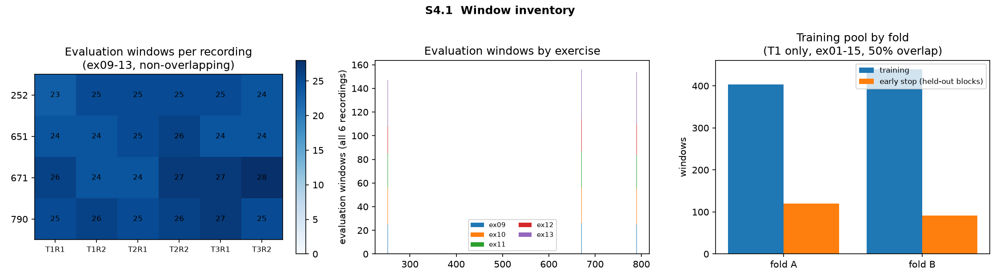
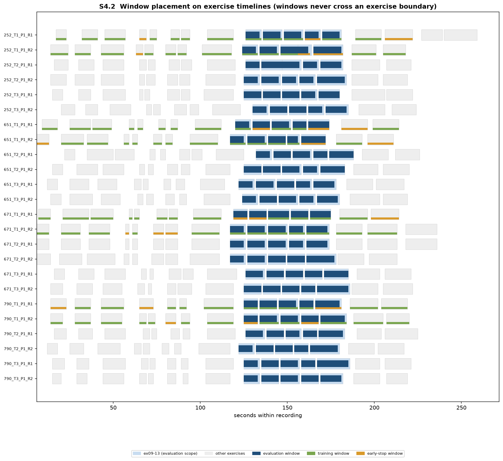

# Window inventory report (S4)

Generated by `scripts/s4_window.py`. Index in
`outputs/s4_windows/window_index.csv`, figures in `figures/s4_windows/`.

---

## 1. Windowing rules

Fixed before any model exists, and applied identically to every recording.

| Parameter | Value |
|---|---|
| Window length | 240 frames = 2.0 s at 120 Hz |
| Training stride | 120 frames (50 percent overlap) |
| Evaluation stride | 240 frames (non-overlapping) |
| Boundary rule | a window never crosses an exercise boundary |
| Assignment unit | the contiguous exercise block, never the window |

The assignment unit is the point that matters. Windows drawn from the same
exercise block are strongly correlated, so splitting at window level would leak
between training and early stopping and make the early-stopping signal
optimistic. Whole blocks are assigned.

---

## 2. Inventory

1657 windows in total, with no missing data in any of them.

| Role | Windows | Source |
|---|---|---|
| `training` | 842 | ex01-15 of the fold's T1 repetition, 50 percent overlap |
| `early_stop` | 211 | held-out 20 percent of those blocks |
| `evaluation` | 604 | ex09-13 of all 24 recordings, non-overlapping |

### 2.1 Evaluation windows per recording

Between 23 and 28, median 25.

| Participant | T1 R1 | T1 R2 | T2 R1 | T2 R2 | T3 R1 | T3 R2 |
|---|---|---|---|---|---|---|
| 252 | 23 | 25 | 25 | 25 | 25 | 24 |
| 651 | 24 | 24 | 25 | 26 | 24 | 24 |
| 671 | 26 | 24 | 24 | 27 | 27 | 28 |
| 790 | 25 | 26 | 25 | 26 | 27 | 25 |

Coverage is even; no recording is starved. Each recording-level embedding will
therefore be an average over roughly 25 **independent** windows, since
evaluation windows do not overlap.

This is the reason evaluation was widened from ex11 alone to ex09-13 pooled.
ex11 by itself yields only about 5 windows per recording, too few for a stable
recording-level mean. ex11 is retained as a pre-specified breakdown.

### 2.2 Training pools by fold

| Fold | Trains on | Trajectory on | Training windows / blocks | Early-stop windows / blocks |
|---|---|---|---|---|
| A | T1-R1 | R2 | 403 / 47 | 120 / 12 |
| B | T1-R2 | R1 | 439 / 48 | 91 / 12 |

Each fold trains on the four T1 recordings of one repetition only: roughly
580 seconds, about 10 minutes of motion.

---

## 3. Leakage controls

| Check | Result |
|---|---|
| Windows crossing an exercise boundary | **0** |
| Blocks split across training and early stop | **0** |
| Windows with any non-finite value | **0** (of 1657) |
| Blocks too short for a single 2 s window | 0 in scope |

Every window additionally carries `seen_in_training_A` and
`seen_in_training_B`. Under fold A the four `T1-R1` recordings are in-sample,
so their evaluation windows are **not** a clean measurement; under fold B the
same is true of `T1-R2`. This is exactly why the design traverses the whole
T1-T2-T3 trajectory on the repetition the model never saw, and why the flag is
carried explicitly rather than left implicit.

The timeline figure shows every window placed on its recording's exercise
timeline. Evaluation windows (dark blue) sit inside the ex09-13 band; training
and early-stop windows (green and orange) appear only on T1 recordings.

---

## 4. Honest limits of this inventory

* **The training set is small.** About 400 windows of 2 seconds per fold, from
  four people in a single session each. A 38k-parameter model is sized for
  this, but it is the binding constraint on the whole experiment, and the mask
  ratio sweep and the matched-task convolutional baseline exist precisely to
  detect the case where the model is fitting too little data to be meaningful.
* **Early stopping rests on 12 blocks** (91-120 windows) per fold. That is
  enough to stop training, not enough to select architecture. No architectural
  choice may be made against it.
* **Evaluation windows are independent within a recording but not across
  exercises**: the same five exercises are pooled in every recording, which is
  intended, since it holds task content fixed across timepoints.

---

## 5. Status

**S4 passes.** 1657 windows, zero boundary crossings, zero split blocks, zero
missing data, and an even 23-28 evaluation windows per recording.
